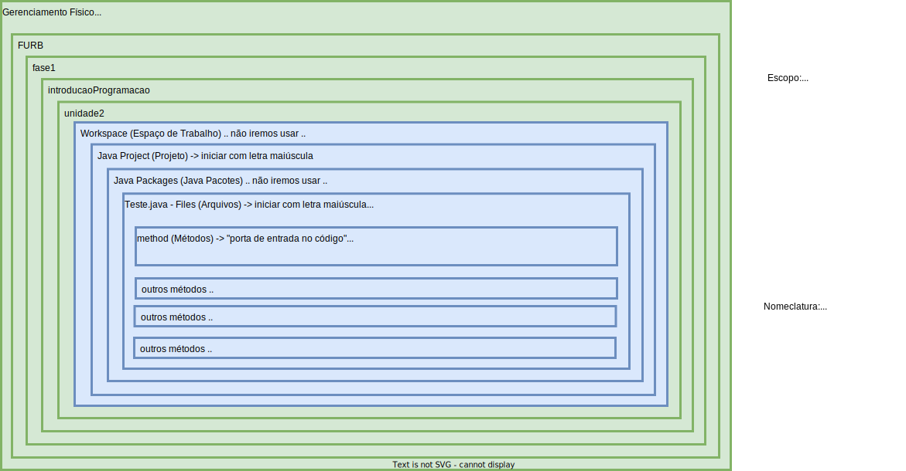
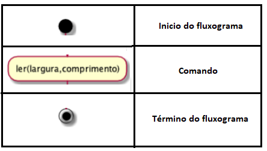
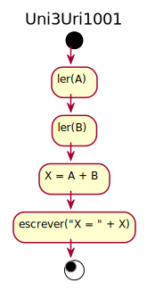
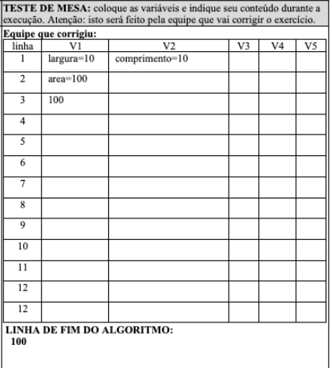
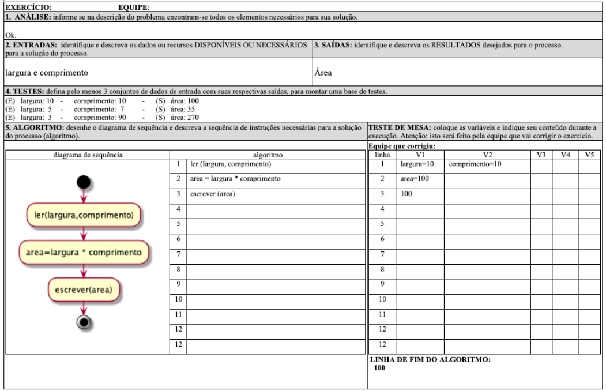
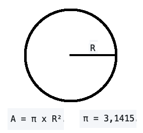
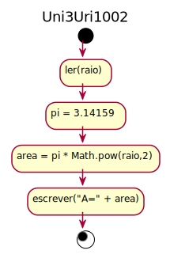

<!--  FIXME:
### [Aula_04](Unidade2/aula.md#Aula_04 "	28-02-2022	segunda	")	28-02-2022	segunda
### [Aula_05](Unidade2/aula.md#Aula_05 "	02-03-2022	quarta		02-03-2022	quarta
### [Aula_06](Unidade2/aula.md#Aula_06 "	02-03-2022	quarta	")	02-03-2022	quarta
-->

# Algumas anotações das aulas  

##   

##   

## Introdução à Programação - Unidade 2  

Na última aula resolvemos dois problemas iniciais utilizando Java no VSCode.  
Na aula de hoje, entenderemos um pouco mais a respeito do ambiente a ser utilizado durante o semestre, bem como resolveremos novos exercícios para treinar a habilidade de solucionar problemas e de interpretar textos.  

## Perfil do aluno  

Favor responder o [formulário](<https://forms.office.com/Pages/ResponsePage.aspx?id=KiItDNrscEuWCqzvbO0wUln0WMIdJTRDgdaFzW1RRxdUNVdPVUJHVzUwVk9LOVNLVkQxQVo0SEE1Ui4u> "formulário de perfil") para que possamos conhecer melhor o seu perfil.  

## Mostrar VScode  

- Como criar projeto  
- Como salvar arquivos (após salvar com a extensão correta o VSCode compreende que é código Java)  
- Terminal: visualizar respostas, limpar, reiniciar  
- Como depurar código e visualizar as variáveis  
- Vídeo: o que é uma IDE? <https://youtu.be/GPcIjsz-2cA>  

## Nomenclaturas  

- Nome do projeto sempre iniciando com letra maiúscula  
- Nome do arquivo (classe) sempre iniciando com letra maiúscula  
- Nome das variáveis sempre iniciando com letra minúscula  

Nomes podem conter letras, números e _. Não podem conter caracteres especiais, espaços e acentuação! Devem iniciar sempre com uma letra.  

## Sobre o que já desenvolvemos na última aula  

### Tipos de dados  

- Diferenciar os tipos de dados (inteiro, decimal e texto)  
- Explicar a diferença de float e double (colocar "f" atrás do valor. Ex: float n = 4.5f;)  
- Explicar brevemente diferença entre tipo primitivo e String  

### Operadores  

- Atribuição  
- Aritméticos  
- Concatenação  
  
### Comandos  

- Entrada: Scanner  
- Saída: System.out.print / System.out.println  

### Fluxogramas  

- Explicar a notação usada  
- Ter uma imagem sem ser um algoritmo e com legenda para cada símbolo usado no desenho do fluxograma  
- Só mostrar os fluxogramas usados nos algoritmos acima  
- Deixar um ou dois fluxograma para passarem para o VSCode  

  

### Estrutura de um algoritmo  

#### Análise  

  

#### Entradas

  

#### Saída  

  

#### Testes  

  

#### Algoritmo  

  

#### Teste de Mesa  

  

#### Formulário completo  

  

## Algoritmos para práticar  

### Problema 1 (Uni3Uri1002)  

    A fórmula para calcular a área de uma circunferência é definida como A = π x R². Considerando este problema que π = 3,1415. Calcule a área usando a fórmula fornecida na descrição do problema.  

- Entendendo o problema  
  
  

- fluxograma  
  
  

### Problema 2 (Uni3Uri1008)  

    Escreva um programa que leia o número do funcionário, o número de horas trabalhadas em um mês e o valor que ele recebeu por hora. Este valor sempre será um valor inteiro. Imprima o número do funcionário e o salário que ele receberá no final do mês.  

- Entendendo o problema  
  
- fluxograma  

## [Atividades - Aula](atividadeAula.md "Atividades - Aula")  

Vamos praticar um pouco com alguns enunciados ...  

## Ambiente de Desenvolvimento Prático - Apoio

- [x] [Ambiente de Desenvolvimento Prático](../Unidade1/IDE.md "Ambiente de Desenvolvimento Prático").  
